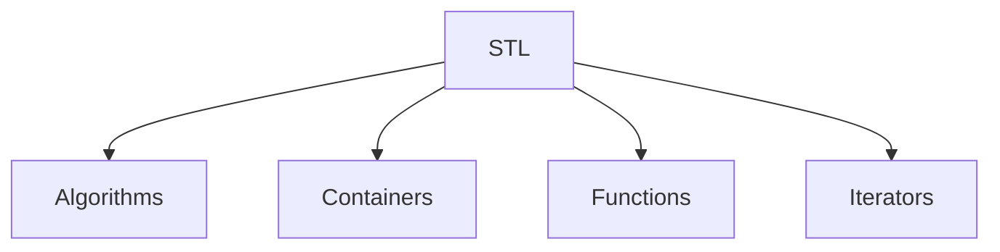

# Standard Template Library (STL)

The **Standard Template Library (STL)** in C++ is a powerful set of C++ template classes that provide general-purpose classes and functions with templates for algorithms, data structures, and iterators. It enables developers to efficiently implement complex data structures and algorithms without reinventing the wheel.

## Classification of STL

## Definitions

### 1. Algorithms
Algorithms are a set of functions designed to perform operations on data structures. They include sorting, searching, and manipulating data, providing a standardized way to handle common operations.

### 2. Containers
Containers are data structures that store objects and data. STL provides several types of containers, such as:
- **Sequence Containers**: Store elements in a linear sequence (e.g., `vector`, `deque`, `list`).
- **Associative Containers**: Store elements in a sorted order based on keys (e.g., `set`, `map`).
- **Unordered Associative Containers**: Store elements in an unordered fashion (e.g., `unordered_set`, `unordered_map`).
- **Container Adapters**: Provide a different interface for existing containers (e.g., `stack`, `queue`).

### 3. Iterators
Iterators are objects that allow traversal through the elements of a container. They provide a uniform way to access elements regardless of the underlying container type.

